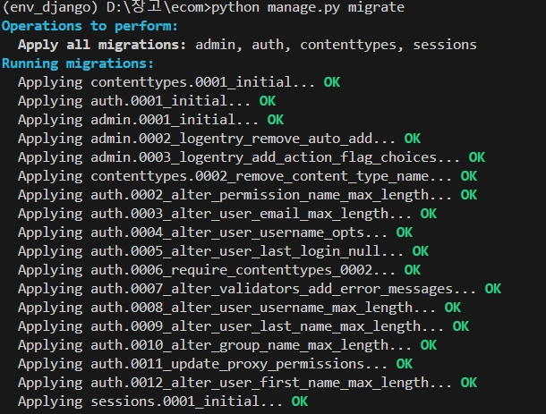
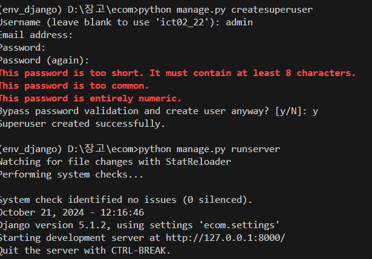
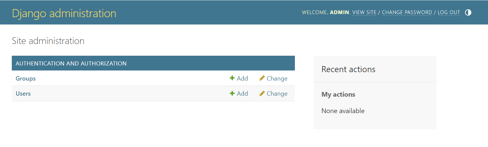

https://www.youtube.com/watch?v=Cp7geK7xjyI&list=PLCC34OHNcOtpRfBYk-8y0GMO4i1p1zn50&index=2

##### 1. 마이그레이션 명령 실행

python manage.py migrate



##### 2. 다시 python manage.py runserver 실행

#### 3. super 유저 생성



#### 4. admin으로 접속



#### 5. media URL 등록

> https://velog.io/@duo22088/Django-Media-file-%EB%8B%A4%EB%A3%A8%EA%B8%B0

<hr>
Static & Media 파일
1. Static

개발 리소스로서의 정적인 파일 (js, css, image 등)
앱 / 프로젝트 단위로 저장 및 서빙 2. Media

유저가 업로드 한 모든 정적인 파일 (image, pdf)
관리자가 admin 페이지에서 올리는 파일도 포함이다.
FileField/ImageField를 통해 저장한 모든 파일
💡 DB필드에는 저장경로(문자열)를 저장하며, 파일은 File Storage에 저장된다.
💡 프로젝트 단위로 저장 및 서빙

Media 파일 경로 설정
settings.py

◽ MEDIA_URL : 각 media 파일에 대한 URL Prefix. 필드명. url 속성에 의해서 참조되는 설정.
◽ MEDIA_ROOT : 파일필드를 통한 저장 시에, 실제 파일을 저장할 ROOT 경로.>

```
# BASE_DIR은 base.py의 위치에 따라 결정되기 때문에
# 운영 서버 또는 개발 머신 어디서나 프로젝트를 구동할 수 있음.
# 따라서 파일 경로 관련해서는 절대 하드코딩을 하지말자.
BASE_DIR = os.path.dirname(os.path.dirname(os.path.abspath(__file__)))
...

MEDIA_URL = '/media/'		# ex) /media/photo1.png
MEDIA_ROOT = os.path.join(BASE_DIR, 'media')
```
